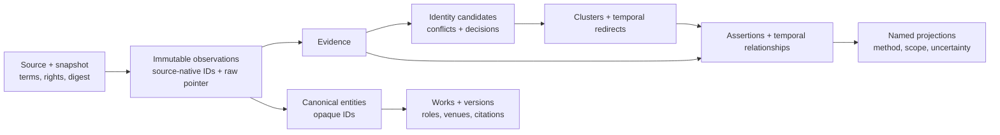
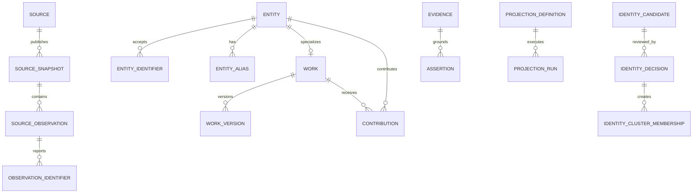
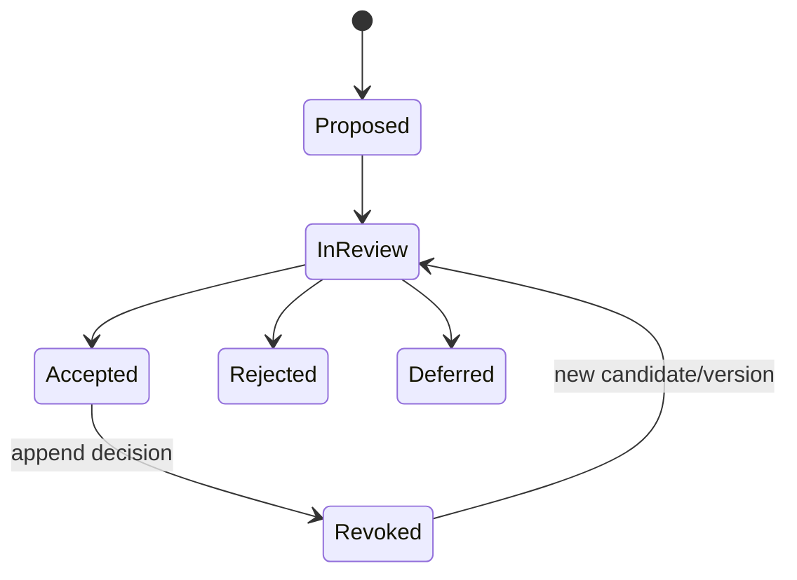

# People Graph v3: evidence ontology and additive SQLite contract

**Status:** standalone proposal, `3.0.0-draft.1`  
**Date:** 2026-08-06  
**Base audited:** `sisodias/siso-people-graph@de048bb3b34bf931b56fd741cb46c1334acdfb98`

## Decision

Build v3 as a rebuildable evidence graph beside v2. Source records remain
immutable observations; opaque canonical entities, identity decisions, claims,
relationships, and projections are separate layers. This PR does not alter v2,
load production data, or replace the current release asset.

The current graph proved the value of cross-domain people and roles on edges, but
its source-shaped person IDs, string-embedded Works, name-driven book matching,
and weak decision lineage make further scale unsafe. V3 keeps the useful parts
while making every resolution and derived result explicit.

## Reconstructing the proposal

The complete, independently checkable engineering trail is indexed in
[`people-graph-v3-audit-index.md`](people-graph-v3-audit-index.md). It includes
the exact lane contract, pinned source/blobs, observed-fact versus inference
separation, stable decision records, rejected alternatives, implementation
chronology, requirement-to-test maps, validation transcripts, artifact hashes,
and adversarial review checks. Machine-readable twins live in `schema/v3/`.

## Layer model





## Core invariants

1. **No silent name merge.** Names and real names are labels or aliases, never
   globally unique identifiers.
2. **Handles are aliases.** A stable platform-issued account ID may be an
   identifier; a mutable login remains non-unique unless an authority definition
   proves otherwise.
3. **Source survives correction.** Envelope receipts and source observations are
   append-only. Status events record supersession, tombstones, deletion requests,
   and revoked raw pointers.
4. **Canonical IDs are opaque.** They are generated independently of names,
   handles, domains, or source-native IDs.
5. **Identity is a decision record.** Candidates carry positive, negative, and
   conflicting evidence. Accepted decisions are append-only and may be revoked;
   cluster memberships and redirects have validity intervals.
6. **Every accepted fact is traceable.** Assertions and relationships include
   evidence, observed time, extraction method, confidence, status, and deciding
   authority where applicable.
7. **Works are entities.** Work, version/expression/edition/release, contribution,
   venue, citation, dependency, and locator are queryable rows rather than title
   strings on a person edge.
8. **Policy travels with data.** Source snapshots, observations, Works, evidence,
   assertions, and projection runs carry rights and publication state; privacy is
   also explicit where personal data can appear.
9. **Vocabularies do not collapse.** Terms stay in source namespaces. Crosswalks
   are explicit, evidenced, versioned mappings.
10. **Model output is not observation.** It records model, version, input digest,
    and proposed status; it cannot satisfy the source-evidence constraint.
11. **No universal score.** Rankings and affinities are named/versioned
    projections with source scope, as-of time, input digest, method card, and
    uncertainty.

## Source and observation contract

`source_snapshot` is the replay unit: source-native revision, retrieval and
snapshot time, terms revision, rights/privacy/publication state, acquisition
method, SHA-256 digest, expected count, parent snapshot, and removal obligations.
A `source_observation` preserves source-local subject identity, observed versus
retrieved time, attributes, payload digest, and a governed raw pointer.

The exact `pg-observation-0.1` JSON is stored in
`observation_envelope_receipt`. Checks reject top-level or subject canonical IDs.
Child arrays map to observation identifiers, contributions, relationships, and
evidence. Import deliberately stops before canonicalization; see
`schema/v3/observation-envelope-mapping.md`.

Example envelope fragment:

```json
{
  "envelope_version": "pg-observation-0.1",
  "source": {
    "source_id": "fixture-a",
    "snapshot_id": "fixture-a-2026-08-06",
    "record_native_id": "author-1",
    "observed_at": "2026-08-05T12:00:00Z",
    "retrieved_at": "2026-08-06T00:00:00Z",
    "terms_revision": "fixture-terms-1",
    "rights_state": "open_data",
    "payload_sha256": "aaaaaaaaaaaaaaaaaaaaaaaaaaaaaaaaaaaaaaaaaaaaaaaaaaaaaaaaaaaaaaaa"
  },
  "subject": {
    "kind": "person",
    "source_native_id": "author-1",
    "label": "Zoë Tanaka",
    "attributes": {"affiliation": "Example Lab"}
  },
  "identifiers": [], "contributions": [], "relationships": [],
  "evidence": [], "raw_pointer": "fixtures/author-1.json"
}
```

## Identity model and reversibility

Identifier semantics are registered before use: scope policy, uniqueness,
mutability, trust class, source authority, normalization method, version, and
whether auto-resolution is even eligible. A partial unique index enforces only
accepted, active, unique identifiers inside their declared scope. Mutable or
non-unique values may collide without implying identity.



An open conflict blocks an accepted decision. Merge application creates temporal
cluster memberships and redirects; undo appends a revocation and closes those
intervals. Neither entity nor any source observation is deleted.

## Works, claims, and time

A canonical entity of kind `work` is specialized by `work`. `work_version`
represents expression, edition, release, revision, translation, or
manifestation. Contributions hold contributor, Work/version, role namespace,
role, ordinal, credited name, observed time, and validity. Separate tables model
venues, citations, dependencies, and locators.

Generic `assertion` supports entity objects or JSON values, optional topic terms,
scope, confidence, review status, valid time, observed time, extraction method,
model lineage, deciding authority, and primary evidence. Assertions may support,
challenge, contradict, supersede, or qualify each other. Typed `relationship`
rows have explicit inverse/type definitions and validity intervals.

## Example queries

```sql
-- All accepted roles for a person, preserving Work versions.
SELECT w.title, wv.version_type, wv.version_label, c.role, c.ordinal
FROM contribution c
JOIN work w ON w.work_id = c.work_id
LEFT JOIN work_version wv ON wv.work_version_id = c.work_version_id
WHERE c.contributor_entity_id = :entity_id AND c.status = 'accepted';

-- Identity candidates that cannot yet be accepted.
SELECT c.candidate_id, c.confidence, x.conflict_type, x.description
FROM identity_candidate c
JOIN identity_conflict x ON x.candidate_id = c.candidate_id
WHERE x.status = 'open';

-- Accepted relationships true at a requested time.
SELECT r.*, t.namespace, t.local_name
FROM relationship r
JOIN relationship_type t USING (relationship_type_id)
WHERE r.subject_entity_id = :entity_id
  AND r.review_state = 'accepted'
  AND (r.valid_from IS NULL OR r.valid_from <= :as_of)
  AND (r.valid_to IS NULL OR r.valid_to > :as_of);

-- Search canonical labels and accepted aliases without ASCII-derived IDs.
SELECT DISTINCT entity_id FROM entity_search
WHERE entity_search MATCH :unicode_query;
```

## Scale strategy

The logical model targets at least 10× observations without pretending one file
is the final physical layout. Bulk builds should order snapshots deterministically,
verify content digests before import, defer secondary indexes during trusted bulk
load where measured, and publish row counts plus logical digests. High-volume
observations may be partitioned into attached read-only SQLite shards or an
external columnar data plane while canonical decisions remain compact. Raw
payloads and production databases stay outside Git.

Query usefulness grows by indexing resolution seams rather than adding one more
score: identifier lookup by scheme/value/scope, Unicode FTS aliases, Work and
contribution joins, relationship endpoint/time indexes, decision/conflict state,
and named projection metadata. Every projection can be reproduced from its
method version, scope, parameters, as-of time, and input digest.

## Rebuild and migration

V3 is reconstructed from declared source snapshots and replayable envelopes. The
build creates a fresh database, loads observations, verifies counts/digests,
materializes reviewed canonical decisions, and runs integrity/parity checks. The
current v2 release asset remains read-only and is never altered in place.

A query adapter should capability-detect v2 versus v3. During coexistence it may
translate v2 people/content rows into observation-shaped responses, but it must
label those responses as compatibility data and must not import v2 name matches
as accepted identity decisions. Promotion requires independent v3 validation and
an explicit consumer cutover.

## V2 compatibility limits

| V2 surface | V3 treatment | Limit during coexistence |
| --- | --- | --- |
| Namespaced `person_id` | Opaque `entity_id` plus identifiers/aliases | No stable one-to-one mapping without reviewed evidence. |
| `external_ids` | Registered identifier semantics and scoped assignments | Existing values need scheme review before uniqueness claims. |
| `person_content` | Work, version, contribution, venue, citation, dependency, locator | Title/ref strings are observations, not automatically canonical Works. |
| `identity_claim` | Candidate, evidence, conflict, append-only decision, cluster/redirect | V2 accepted rows are inputs for review, not ground truth. |
| `primary_tier` / score | Named projection definition/run/value | Never copied as a universal canonical property. |
| `person_search` | One FTS row per canonical label and accepted alias | Unicode search is supported; locale morphology is not solved. |

## Rejected alternatives

- **In-place v2 migration:** rejected because it would rewrite a current release
  asset and cannot recover evidence v2 never retained.
- **Name-normalized canonical IDs:** rejected because collisions and name changes
  turn a display field into irreversible identity.
- **One polymorphic edge table:** rejected because Work roles, citations,
  dependencies, identity decisions, and assertions have different invariants.
- **Automatic stable-ID merge without conflict records:** rejected because two
  authority IDs can disagree and must block acceptance visibly.
- **Flattening source vocabularies:** rejected because identical strings can have
  different authorities and meanings.
- **A canonical influence/tier column:** rejected because scope and methodology
  determine the result; uncertainty must remain visible.
- **Deleting losing entities after merge:** rejected because corrections would
  destroy lineage and source observations.

## Audit and reverse-engineering packet

The public record is indexed in
[`people-graph-v3-audit-index.md`](people-graph-v3-audit-index.md). The principal
reconstruction artifacts are:

- [`people-graph-v3-source-prompt.md`](people-graph-v3-source-prompt.md) and
  [`people-graph-v3-agent-brief.md`](people-graph-v3-agent-brief.md) — exact
  shared rules, envelope, Prompt 3, and source digests;
- [`people-graph-v3-evidence-ledger.md`](people-graph-v3-evidence-ledger.md) and
  [`people-graph-v3-source-ledger.md`](people-graph-v3-source-ledger.md) — pinned
  repositories, commits, blobs, observations, limits, and explicit non-sources;
- [`people-graph-v3-decision-record.md`](people-graph-v3-decision-record.md),
  [`people-graph-v3-design-journal.md`](people-graph-v3-design-journal.md), and
  [`people-graph-v3-worklog.md`](people-graph-v3-worklog.md) — decisions,
  alternatives, consequences, chronology, commands, failures, and seams;
- [`people-graph-v3-validation-record.md`](people-graph-v3-validation-record.md)
  and [`people-graph-v3-independent-review.md`](people-graph-v3-independent-review.md)
  — exact local validation plus a falsification checklist;
- [`../../schema/v3/PROVENANCE.json`](../../schema/v3/PROVENANCE.json),
  [`../../schema/v3/design_provenance.json`](../../schema/v3/design_provenance.json),
  [`../../schema/v3/traceability.json`](../../schema/v3/traceability.json), and
  [`../../schema/v3/ARTIFACTS.sha256`](../../schema/v3/ARTIFACTS.sha256) —
  machine-readable receipts and full-file SHA-256 inventory.

These records publish all reproducible evidence, bounded inferences, decisions,
workings, commands, outputs, and unresolved questions. They do not publish
private token-by-token model chain-of-thought, credentials, authentication
material, or unrelated scratch data; none is required to audit or reproduce the
proposal.

## Disputed decisions for integration

The schema leaves five choices explicit: one SQLite file versus attached
observation shards; direct observation provenance versus multi-evidence accepted
assertions for canonical labels; text scope references versus first-class scope
entities; one `work_version` table versus subtype tables; and which, if any,
stable unique identifier schemes may auto-accept. These are future ADRs, not
hidden dependencies on another parallel branch.
